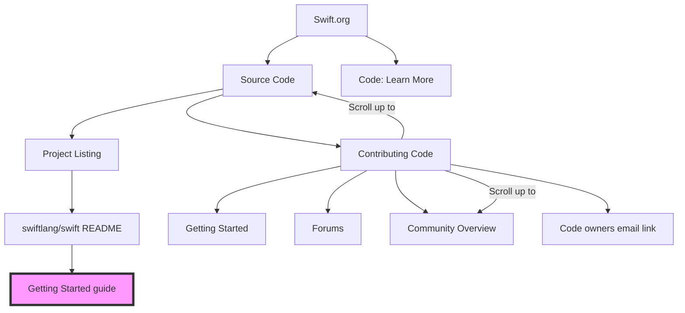

# Swift Information Architecture Project

* Proposal: [SIAP-0001](0001-swift-information-architecture-project.md)
* Author: [James Dempsey](https://github.com/dempseyatgithub)

## Overview

Over the past ten years, the Swift project has grown from a handful of GitHub repositories to a large number of projects, including the [Swift.org](http://Swift.org) website. Over that time there has been no unified information architecture—content and its organization has developed organically. This project aims to define underlying principles for information architecture and then apply those principles to existing and future content across all of the sites of the Swift project.

At a high level the development of the information architecture will have three phases:

1. Develop underlying principles for the architecture
2. Design architecture for existing pages and content according to the principles
3. Plan and implement architecture across existing pages and content

All architecture documents will be made available in the Swift forums for community review and feedback.

### Principles

* **Organization-wide Architecture**
The Swift project provides information in a variety of ways including [Swift.org](http://Swift.org) pages, DocC-generated documentation, GitHub repositories, and more. The information architecture needs to span all of these to provide a cohesive strategy for the entire project.
* **Best Suited Site**
Information will be presented where it is best suited for the content and audience. For example, GitHub is well suited to host content about contributing to swiftlang projects, whereas [Swift.org](http://Swift.org) is well suited for content aimed at newcomers and users of the Swift language.
* **Single Source of Truth**
The project should strive to have a single source of truth for a topic across all official Swift project sites.
* **Progressive Disclosure**
Information should be presented as a high level summary first with the ability to drill down into increasing detail and specificity.
* **Data-driven**
Where possible, presented information should be data-driven via json or yml files or other files with structured data.
* **Funnels / Slippery Slopes**
Where appropriate, content should present encouragement and next steps focusing on leading visitors towards:
  * Further Learning
  * Community Engagement
  * Contributing

### Sites / Information Sources

In addition to [Swift.org](http://Swift.org), the Swift project has a number of online sources of information and community interaction:

* [Swift.org](http://Swift.org)
* Swift Forums
* GitHub repositories

There are also sources of information that are outside the direct control of the Swift project that need to be taken into account:

* [developer.apple.com](http://developer.apple.com)
* [Swift Package Index](https://swiftpackageindex.com)
* [Swiftinit Documentation Index](https://swiftinit.org)

Part of the information architecture of the project is a clear definition and rationale of which content belongs on which site. Or more colloquially stated as "a place for everything and everything in its place".

### Audience

There are many ways and levels of granularity that the audience of the sites can be categorized.

At a high-level the audience falls into three categories:

1. Newcomers
2. Swift Developers
3. Contributors
a. Potential Contributors

Each section and page on [Swift.org](http://Swift.org) should have a specific audience in mind. A page or piece of content may be useful to more than one audience, but the content and tone should be geared towards the primary audience.

The 'Potential Contributors' audience is a case where pages or content that are primarily focused on another audience may have this as a secondary or tertiary audience in the form of an encouragement or call to action to contribute.

### Use Cases / Specialties

In addition to audiences as mentioned above, another way to categorize the audience is by use case or specialty. This is an area that could potentially lead to a significant expansion of [Swift.org](http://Swift.org), for example providing specific landing pages focused on use cases such as server-side Swift or embedded Swift.

Current use cases beyond Apple platform app development include:

* Swift on Server
* Embedded Swift
* C++ Interoperability
* Platform-specific / Linux / Windows

### Summary

These are the main principles, sites and audience segments that will inform the information architecture.

## Current Site Examples That Violate Proposed Principles

This section contains some examples demonstrating issues with the current information architecture of the project. They are small case studies of how information on the site has grown organically without an overall strategy and provide motivation for a unified information architecture.

### "Slippery Slope" Example

The diagram below depicts the current state of trying to get from the *Contributing* item on the main page of [swift.org](http://swift.org) to the *Getting Started* directions of contributing to the `swiftlang/swift` project.

At present, the site is a tangle of links and backlinks with only one path that actually brings the visitor to steps to get started contributing.

The path should be much more clear and direct.

### Single Source of Truth Example

The Swift Package Manager currently has at least four different sources of documentation.

This makes it difficult for newcomers and developers to find all the relevant documentation for Swift packages and make it likely that one part of the documentation or another will become out of date.

There is the overview and tutorial on [Swift.org](http://Swift.org):
[Swift.org - Package Manager](https://www.swift.org/documentation/package-manager/)

The markdown documentation in swiftlang/swift-package-mananger:
https://github.com/swiftlang/swift-package-manager/blob/main/Documentation/README.md

The DocC generated content hosted on [docs.swift.org](http://docs.swift.org);
[PackageDescription API — Swift Package Manager](https://docs.swift.org/package-manager/PackageDescription/index.html)

And finally documentation on [developer.apple.com](http://developer.apple.com):
[Swift packages | Apple Developer Documentation](https://developer.apple.com/documentation/Xcode/swift-packages)
[PackageDescription | Apple Developer Documentation](https://developer.apple.com/documentation/PackageDescription)

There is likely to be some duplication between the Swift project and [developer.apple.com](http://developer.apple.com). But otherwise, cases like this should move towards a single source of truth.

## Next Steps

The goal of this document is to articulate the underlying principles of the information architecture.

The intent is that the underlying principles provide guidance moving forward as new types of content may need to be added to the information architecture.

The next step is to solicit and incorporate feedback from a wider audience, including the website, contributor experience, and documentation workgroups to get agreement on the principles.

The final step is methodically going through existing content and making and implementing plans for each section.

## Technical Requirements

The project has no specific technical requirements. The design will take the capabilities and limitations of each site / information source into account.

## Project Timeline

The timeline of the project reflects its comprehensive scope beginning with principles, progressing to design and culminating in detailed changes to implement the architecture.

### Phase 1: Develop Core Principles

* Develop a set of core principles to guide the information architecture design.
* Review and refine principles based on stakeholder and community feedback.
* Form working groups of stakeholders to focus on applying principles to different areas.
* **Deliverable**: A principles document to guide further design efforts.

### Phase 2: High Level Architecture

* Develop the high level information architecture.
* Conduct a review of existing information architecture.
* Focus on how information will be provided across different project sites.
* Review and refine based on stakeholder and community feedback.
* **Deliverable**: A high level architecture document to guide detailed design efforts.

### Phase 3: Audience / Area Level Architecture

* Working groups develop architecture for each audience / area.
* Review and refine based on stakeholder and community feedback.
* **Deliverable**: An architecture document for each audience/area.

### Phase 4: Detailed Plans and Implementation

* Create detailed plans and file issues for required changes to implement plan.
* Begin implementation of changes.
* **Deliverables** Detailed issues filed to implement architecture.

### Phase 5: Remaining Implementation

* Continue implementation of issues.
* Identify and work to address any implementation blockers.
* **Deliverable** Completed implementation of unified information architecture.

## Roles and Responsibilities

### Project Team

* Dave Verwer (Swift Website and Documentation workgroups)
* David Rönnqvist (Documentation workgroup)
* Diana Ma (Documentation and Server workgroups)
* James Dempsey (DRI)
* Joe Heck (Contributor Experience and Documentation workgroups)
* Paris Pittman(Core Team)

### Stakeholders

* Swift Website Workgroup
* Contributor Experience Workgroup
* Documentation Workgroup
* Swift Core Team
* Apple
* Swift community

## Community Participation

Participation in the Swift Information Architecture project is open to all members of the Swift community.

There are a variety of ways to get involved:

### Join project and working group meetings and discussions

The core effort of the project will be working through the information architecture for different areas of focus. This will happen through small working groups collaborating on the design for each area through meetings and discussions. Please send a message to [@swift-website-workgroup](https://forums.swift.org/new-message?groupname=swift-website-workgroup) on the Swift forums to join this effort.

### Review and provide feedback on design plans and proposals

Once an initial design is created, it will be posted in the Swift Website category on the Swift forums for review and feedback. Turning on the ‘Watching First Post’ notification of the Swift Website category in the Swift forums will notify you when any new Swift Website thread appears, including review threads for this project.

### Working on issues to implement the design

As information architecture designs are finalized, GitHub issues will be created for the concrete changes required to implement the design. These issues will be found on the [Github project page](https://github.com/orgs/swiftlang/projects/12) for this project. Contributing pull requests that resolve these issues will help move the architecture from plan to reality.

Throughout the process, the current status of the project will be available on [GitHub](https://github.com/orgs/swiftlang/projects/12).
