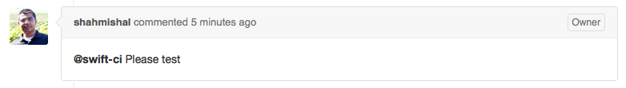
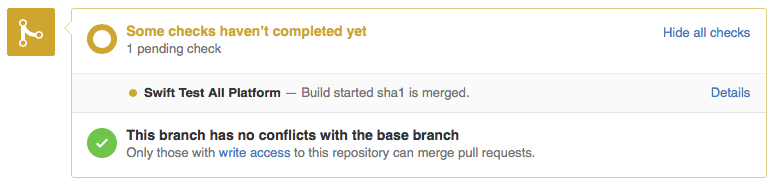
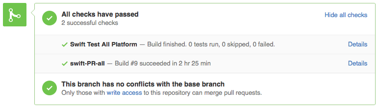
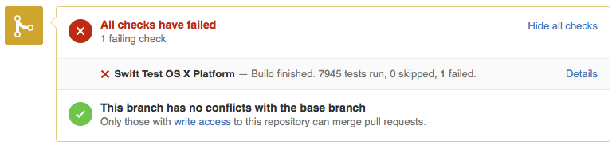

The Swift project follows an [incremental development model](../contributing/#contributing_code), and utilizes continuous integration (CI) testing of changes in pull requests before merging as a core tool for maintaining project stability.  The system produces the snapshot builds posted on swift.org, and runs tests against active branches.  It is also used as part of the review process to run tests against pull requests before committing them.

## Configuration

Our [continuous integration system](https://ci.swift.org) is powered by [Jenkins](https://jenkins.io) and currently supports building and testing on macOS, Ubuntu 18.04, Ubuntu 20.04, Ubuntu 22.04, CentOS 7, and Amazon Linux 2. Testing on the iOS, tvOS, and watchOS simulator is also supported.

### Job organization

Continuous integration jobs are organized within the [CI system](https://ci.swift.org) in the following categories:

* Development - All jobs that are configured to build with main branch
* Swift 5.6 - All jobs that are configured to build with release/5.6
* Packages - Jobs which create toolchains for the main and release/5.6 branches
* Pull Request - Jobs which verify pull requests from GitHub before merging into main.

## Usage

There are several ways in which you can interact with the swift.org CI system:

* Integration job status - you can view the build and test status of all integration jobs at  [https://ci.swift.org](https://ci.swift.org).
* Tests on pull requests - when making a change via pull request, your changes will be tested before being integrated, and results will be posted back inline to the pull request.

More usage documentation can be found [here](https://github.com/swiftlang/swift/blob/main/docs/ContinuousIntegration.md).

### Pull Request Testing

When a change is reviewed on a pull request, a member of the Swift team will trigger testing by the CI system.  Tests can be triggered to run on macOS, Linux, or both platforms.

Testing status is then posted inline with the pull request, showing that a test is in progress.  You can click the "details" link to go directly to the status page for the test in progress.

When tests complete, that result is also updated in the pull request

If there are issues found during testing, you will get a link to the details of the failure.

It is expected that changes meet the [quality standards](../contributing/#quality) for the Swift project before they are committed to the development branch, and you are responsible for fixing problems found by your changes.  If your changes break builds or tests on the development or release branches, you will receive email notification.

## Community Involvement

The Swift project welcomes proposals from the community for adding support for other configurations.

### Swift Community-Hosted Continuous Integration

Community members can volunteer to host nodes for additional platforms on [Swift Community-Hosted Continuous Integration](https://ci-external.swift.org), and are responsible for maintaining the host system.  New nodes can be initiated by creating a pull request at: [Swift Community-Hosted CI Repository](https://github.com/swiftlang/swift-community-hosted-continuous-integration).  Further information about the process is documented in the [README.md](https://github.com/swiftlang/swift-community-hosted-continuous-integration/blob/main/README.md).

The Swift community-hosted CI allows un-supported platforms to be moved over to a supported platform on a case by case basis. Depending on the number of nodes provided, @swift-ci pull request testing can be integrated with the community-hosted CI as well.
