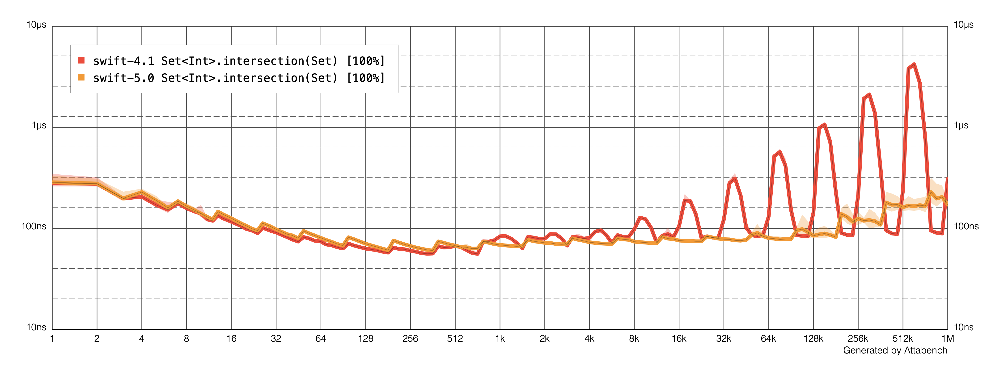

This page contains a list of potential project ideas that we are keen to develop during [GSoC 2019](https://summerofcode.withgoogle.com/). If you would like to apply as a GSoC student, please follow these two steps to get started:

1. Read through this page and identify the project ideas you find interesting.
2. Check out the [Development forum](https://forums.swift.org/c/development) to connect with potential mentors.

## Potential Projects

### Integration of libSyntax with the rest of the compiler pipeline.

**Description**

This project is for integrating the libSyntax tree and making use of it across the rest of the compiler pipeline (typechecker, diagnostics, etc.). It would involve:

* Derive the AST nodes from the libSyntax tree
* Having the parser generate only a libSyntax tree

**Expected outcomes/benefits/deliverables**

A robust architecture with a clean separation of the parsing functionality from the rest of the compiler pipeline, and enabling future work for integrating incremental re-parsing to the compiler pipeline.

**Skills required**

* C++ (familiar)
* Compiler-pipeline Basics

**Potential mentors**

Rintaro Ishizaki

**Expected difficulty**

Medium/Hard

### Implement Code Formatting Functionality for SourceKit-LSP

**Description**

[SourceKit-LSP](https://github.com/swiftlang/sourcekit-lsp) is an implementation of the Language Server Protocol for Swift and C-based languages. The protocol defines range-based code-formatting functionality which is missing from SourceKit-LSP. The task is to add code-formatting using one of the available swift-syntax based code-formatters, like [swift-format](https://github.com/google/swift/tree/format), for Swift.

**Expected outcomes/benefits/deliverables**

* Enhancements to swift-format to provide an API for allowing range-based formatting, not just whole file.
* Implement code-formatting for SourceKit-LSP by integrating swift-format for Swift.
* Ensure SourceKit-LSP's code-formatting functionality works well when used from within Visual Studio Code.

**Skills required**

* Swift (familiar)

**Potential mentors**

Harlan Haskins, Ben Langmuir

**Expected difficulty**

Easy/Medium

### First-class support for authoring the Swift Standard Library via SourceKit-LSP

**Description**

[SourceKit-LSP](https://github.com/swiftlang/sourcekit-lsp) provides full-fledged language support for Swift and C-based languages, for editors that support the LSP protocol, like VSCode and SublimeText. It supports SwiftPM projects and clang's compilation database. The Swift Standard Library has a custom build process that prevents StdLib authors from utilizing SourceKit-LSP for their developement experience. The task is to make the necessary changes and allow SourceKit-LSP to provide first-class support for authoring the Swift Standard Library.

**Expected outcomes/benefits/deliverables**

* Enhance Swift StdLib's build process to emit a compilation database and index data
* Ensure indexing mechanism takes into account Swift's `#sourceLocation` to allow jump-to-definition functionality to just to StdLib's original `gyb` files.
* Ensure Swift Standard Library authoring functionality works well when used from within Visual Studio Code.

**Skills required**

* Familiarity with Swift, C++

**Potential mentors**

Nathan Hawes

**Expected difficulty**

Easy/Medium

### Swift debugging support on Linux

**Description**

LLDB is the debugger of choice for Swift. Debuggers depend more on the underlying platform than compilers, and as a consequence it's more challenging to maintain parity of implementation among operating systems. The meta-goal of the project is that of delivering the same debugging experience on Linux that we have on macOS.

**Expected outcomes/benefits/deliverables**

* Several tests are disabled on Linux (for historical reasons, or because the original author of the commit didn't have time to investigate), those should be audited and reenabled.
* We have Remote mirrors used for macOS, but it requires some work to be fully functional on Linux. That would help simplifying/make more robust a critical codepath and fully supporting resilience on Linux.
* Some data structures which are formatted differ between Linux and macOS. We could write formatters for them.
* Ubuntu is the only fully supported operating system right now. People have reported successes in running swift-lldb on other distributions, it would be nice if we could fix bugs due to difference in libraries, etc..

**Skills required**

Knowledge of C++.
Knowledge of how debuggers work is a plus.
Knowledge of swift object memory layout is a plus, but can be gained during the bonding period.

**Potential mentors**

Davide Italiano

**Expected difficulty**

Easy/Medium

### Scalability benchmarks for the Swift Standard Library

**Description**

The Swift Standard Library contains a large number of performance-critical algorithms. We need to be able to track their behavior and recognize significant changes to their overall performance, preferably before these changes land in the codebase.

The existing Swift Benchmarking Suite does a great job of measuring performance for particular working sets. However, we also need to track how algorithm performance scales as a function of the input size.

For example, a change that slightly improves insertion performance for 400-element dictionaries may turn out to significantly slow down 10-element or million-element dictionaries. In order to make an informed decision on whether to apply such a change, we need to be able to plot performance against input size as a curve; we can't just rely on a single numeric value.

The goal of this project is to augment the existing benchmark suite with scalability tests. The task is to design a Swift module for defining and running such benchmarks, and to provide an automated way of collecting, comparing and visualizing results. The system needs to be able to recognize if there are significant changes between two runs of the same benchmark, and it needs to render the results in a form that lets engineers analyze them at a glance -- such as the log-log plot below.

{:width="100%"}

**Expected outcomes/benefits/deliverables**

The ability for Swift contributors to define scalability benchmarks, and a PR testing trigger that runs them on CI servers, reporting results directly on the GitHub PR interface.

**Skills required**

Familiarity with Swift

**Potential mentors**

Karoy Lorentey

**Expected difficulty**

Easy/Medium

